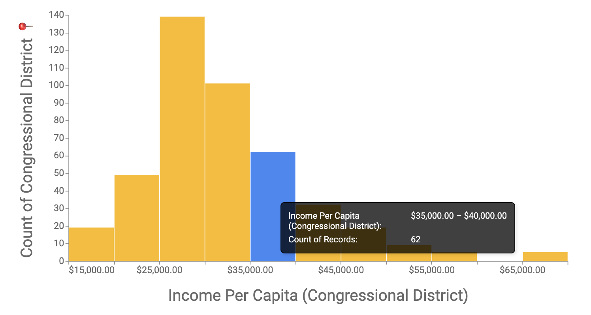
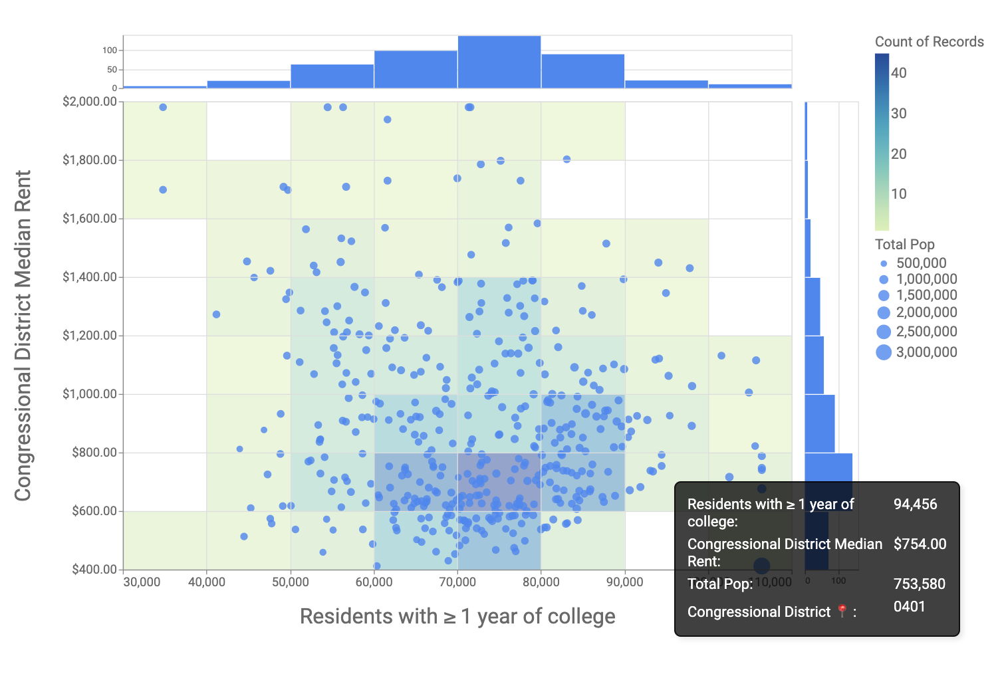
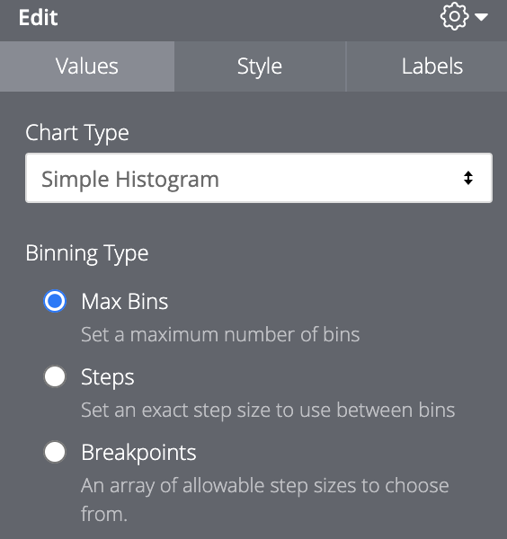
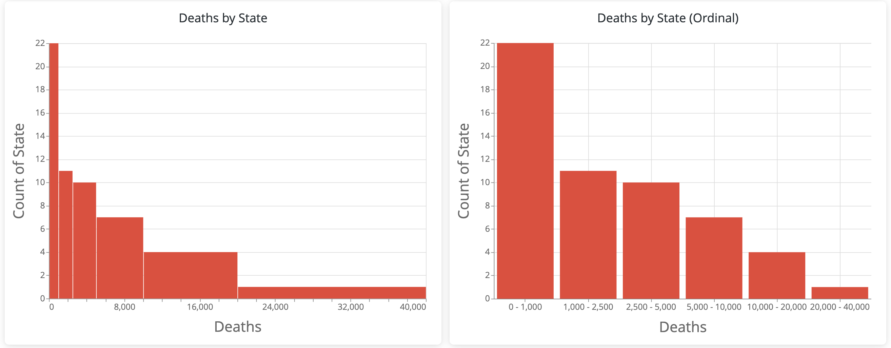
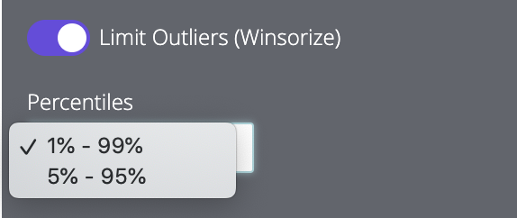
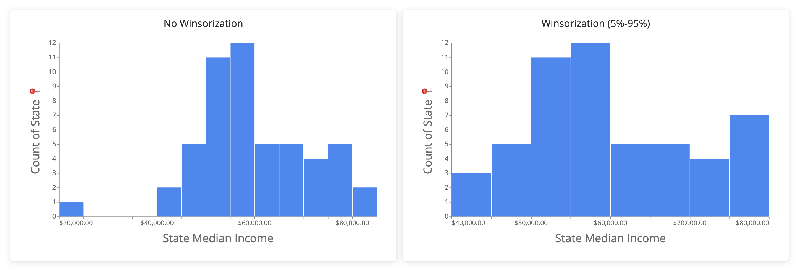

# Histogram for Looker

Histogram visualization for quickly identifying frequency distributions of aggregated data. Useful for quickly binning measures without [requiring a derived table](https://help.looker.com/hc/en-us/articles/360023900353-Bucketing-in-Looker). 

## Chart Types
The Histogram visualization provides two chart styles to choose from. A "Simple Histogram" and a "Scatter Histogram". 

The **Simple Histogram** plots the frequency distribution of a single measure. The first unhidden measure in the result set will be used.

 


The **Scatter Histogram** plots two measures as a scatter plot. Histograms for each measure are displayed opposite of their respective axes. The frequency of points within each X and Y bounded bin are displayed as a toggleable heatmap. Additionally, the Scatter Histogram allows for sizing points by a third measure. 


## Binning Type
The **Binning Type** configuration under "Values" determines how the visualization will bucket the data. 



- **Max Bins**  
    - Use the range slider to set the approximate maximum number of bins (Min = 1, Max = 25). Note that this is an upper bound for the number of bins and that the visualization may not always change when the slider is moved. The binning logic is being optimized by [Vega-Lite](https://vega.github.io/vega-lite/) so not every possible bin will used. You can learn more about how Vega-Lite handles the `max-bin` parameter by [visiting the documentation](https://vega.github.io/vega-lite/docs/bin.html).
    - The default value is "10" bins

- **Steps**
    - Enter a specific value to bucket by. For instance, a value of "1000" would create the bins: [min-999, 1000-1999, 2000-2999, ...]
    - The default value is Floor(Max value/10)

- **Breakpoints**
    - Takes a list of comma separated values to create bins upper threshold e.g. "12, 18, 25, 35, 45, 55, 65, max" would create the bins:[12-17, 18-24, 25-34...]
    - The keywords `min` and `max` can be used in the list to reference the minimum and maximum values of the result set. 
    - The default value is a list created by partitioning the result set into 5 bins: [min, max/5, max/4, ... max]
    - This type allows for "Ordinal" binning. This option may be preferred if step sizes between bins are unequal or large. For example:
        
    - **NOTE:** This bin type is currently only available with the "Simple Histogram" chart type.

## Drilling
To enable drill support, simply ensure that any field in the result set has a `drill_fields` parameter. It is _not_ necessary for the measure being displayed to be the one with the `drill_fields` declaration -- any field will do. 

In the "Simple Histogram" and histograms and heatmap for "Scatter Histogram", the initial drill modal is a subset of the query results filtered by the range of the bin. From there, you'll have access to row specifc drills and links.

Drilling on points in the "Scatter Histogram" scatter plot, however, will provide row specific drills/links. 

## Limit Outliers (Winsorization)
The "Limit Outliers ([Winsorization](https://en.wikipedia.org/wiki/Winsorizing))" toggle under "Values" in the configuration panel allows you to limit the effect of extreme outliers on the visual distribution of the result set. Essentially, outlier values are swapped for the value at their corresponding percentiles (1%-99% and 5%-95%). Stated differently, values below the 1st/5th percentile would _become_ the value at the 1st/5th percentile. Likewise, values above the 95th/99th percentile would _become_ the value at the 95th/99th percentile. 



For example, below on the left shows that States with Median Incomes < $25,000 and those with > $85,000 are skewing the histogram. On the right, "Limit Outliers (Winsorization)" is applied to the 5%-95% percentiles, limiting the effect of those outliers.



**NOTE: This feature will exclude the transformed outliers from drill results.**

## What if I find an error? Suggestions for improvements?
Great! Marketplace content -- including visualizations -- were designed for continuous improvement through the help of the entire Looker community and we'd love your input. To report an error or improvement recommendation, please reach out to Looker support via email to support@looker.com or via chat to submit a request. Please be as detailed as possible in your explanation and we'll address it as quick as we can.


### Interested in extending the visualization for your own use case?
#### Quickstart Dev Instructions
1.  **Install Dependecies.**

    Using yarn, install all dependencies
    ```
    yarn install
    ```
2. **Make changes to the source code**

3.  **Compile your code**

    You need to bundle your code, let's run:
    ```
    yarn build
    ```
    Recommended: Webpack can detect changes and build automatically
     ```
    yarn watch
    ```
    Your compiled code can be found in this repo.

**`./histogram.js`**: This visualization's minified distribution file. 

**`LICENSE`**: Looker's Marketplace content License file.

**`manifest.lkml`**: Looker's external dependencies configuration file. The visualization object is defined here.

**`marketplace.json`**: A JSON file containing information the marketplace installer uses to set up this project.

**`/src`**: This directory will contain all of the visualization's source code.

**`/src/histogram.js`**: The main source code for the visualization.

**`README.md`**: This! A text file containing useful reference information about this visualization.

**`yarn.lock`**: [Yarn](https://yarnpkg.com/) is a package manager alternative to npm. This file serves essentially the same purpose as `package-lock.json`, just for a different package management system.

